#Podio Platform ToDo app tutorial

###In this tutorial:
1. [Preparing the backend](#1-preparing-the-backend)
2. [Connecting to the backend](#2-connecting-to-the-backend)
3. [Authenticating the user](#authenticating-the-user)
4. [Creating the app class](#creating-the-app-class)

## Preface

This tutorial aims to provide an example of how one could build a simple ToDo-type application, using the Podio Platform as a backend for data storage.

At a medium-to-high level it goes over setting up projects and templates in the Podio Platform Console as well as each of the four CRUD operations that this application makes use of.

The example application and this tutorial is **not** meant to be a guide to best practices for how to write and structure your code or even interact with the backend API, but rather a demonstration of how functionality can be created without the need for writing any server-side code.

####Assumed knowledge

It is assumed that you have a solid understanding about the following libraries and technologies:

- jQuery
- JavaScript Promises
- LoDash/Underscore

##1. Preparing the backend
Templates serve as the data models for our app. For this app, we will need 2 templates. One for to-do lists and another for the individual tasks that will go on those lists.

Log in to the [Podio Platform console](https://platform.podio.com/console) to start setting up your templates.

#### Creating a project

First we'll need to create a new project. Hit ***Create project*** in the left-hand column and fill out the form with a fitting name for your app.

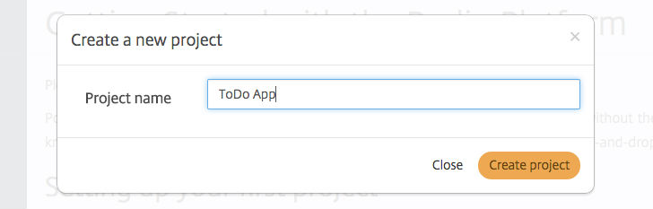

#### Creating the templates

When the project is saved, you will be able to add templates to it by clicking the ***Add template*** button that appears below the project in the left-hand column.

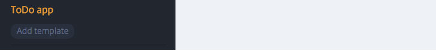

We create our first template and name it "List"

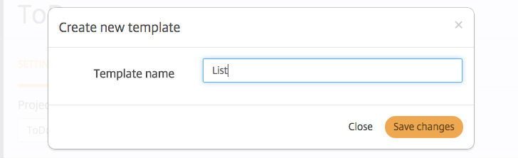

Hit ***Save changes*** and repeat the action to create another template called "Task"

Our project now looks like this:

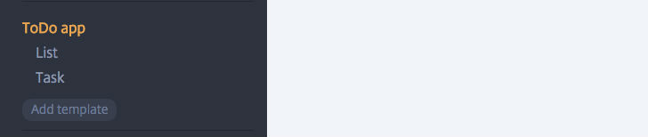

#### Configuring the List template

We now click to select the ***List*** template in order to start editing its fields. For the sake of convinience, the template already comes with a field labeled "title" and we'll keep this, as we want our lists to have a titles.

Besides the title, we need our lists to hold information about the tasks that they contain. There is a special type of field that can be used, when relating templates with each other. That's the ***Relation*** type field.

So we ***click*** or ***drag*** this field type into our template from the field picker list on the right.

Our list template should now look like this:


Now we relate the ***Task*** template to the ***List*** template by clicking and selecting it in the ***Type to search...*** section of the newly created relation field:

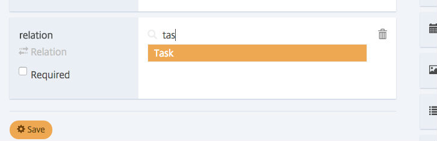

We also make sure to give the field a proper name - "tasks":

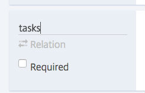

By now, our List template should look like this:

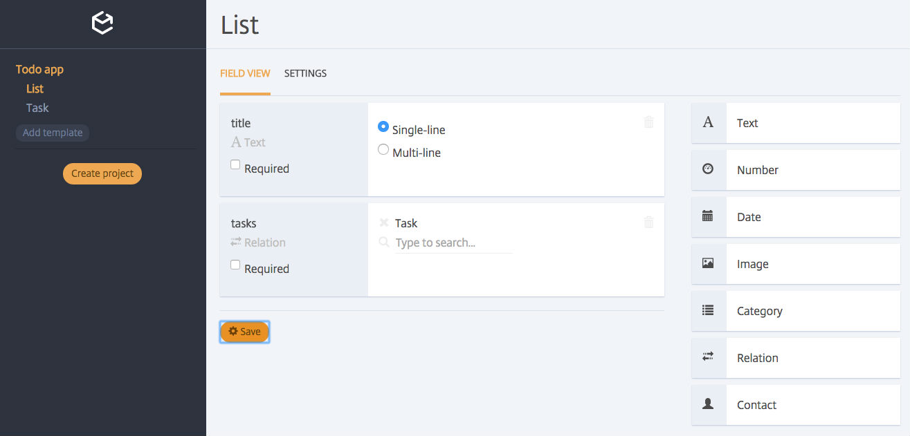

Hit ***Save*** to persist the changes.

#### Configuring the Task template

We click to select the Task template in the left-hand navigation column. Like our List template, this template also needs a title field, since we want our to-do tasks to have a description.

We also need to keep track of whether the to-do task is done or not. I.e. the status of the item. So let's create a "status" field for the template. The field type ***Category*** works well for this, since it allows us to specifiy different options for values.

In our case, we will need the values "Done" and "Pending".

We add the field, like we did before, and add the two categories to the field:

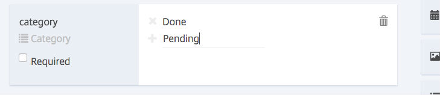

This field should be called something meaningful as well. Why not go with "status".
So now our Task template looks like this:

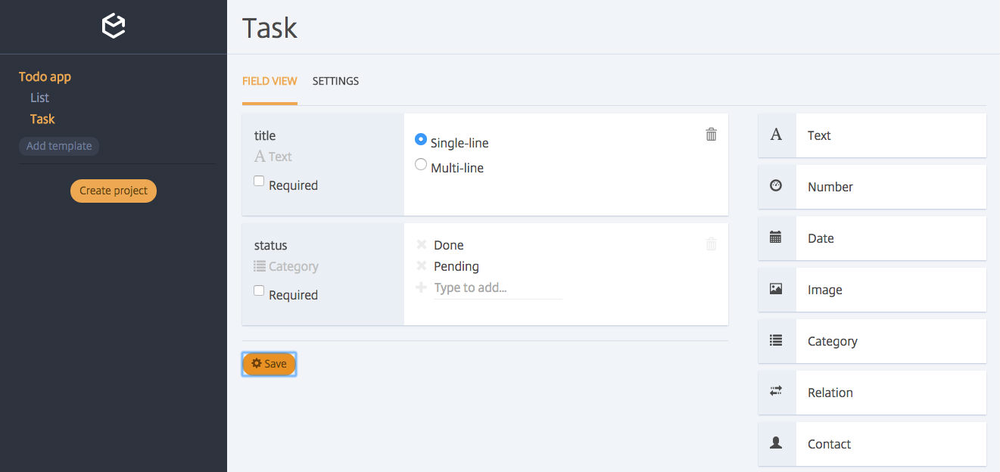

Hit ***Save*** to persist the changes.

##2. Connecting to the backend

When building web applications with Podio Platform, [podio-js](https://github.com/podio/podio-js) is used to interact with the backend.

In order to establish a connection, we need to supply an auth type string, the client ID and client secret for our project.

This information can be found in the Platform Console by selecting the project in the navigation section on the left:

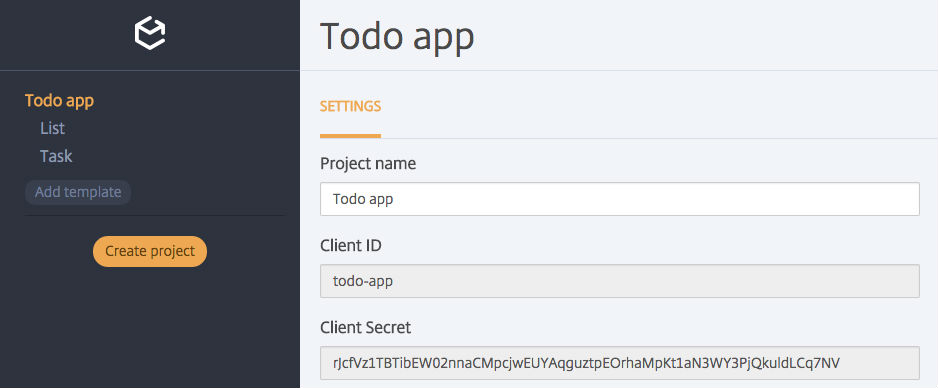

It is usually ***not*** recommended to expose your client secret in a client-side environment, but for the sake of ease in this tutorial, we will use the auth type of ***password*** which requires both the client id and the client secret for connecting.

Here's the code for connecting:

```javascript
var podio = new PodioJS({
  authType: 'password',
  clientId: 'todo-app',
  clientSecret: 'rJcfVz1TBTibEW02nnaCMpcjwEUYAqguztpEOrhaMpKt1aN3WY3PjQkuldLCq7NV'
}, {
  sessionStore: SessionStore
});
```

Notice that we supply a session store in the configuration object in the second parameter. This is so our users won't have to log in every time they refresh the page.

The code for the session store looks like this:

```javascript
var SessionStore = {
  get: function(authType, callback) {
    var podioOAuth = localStorage.getItem('podioOAuth');
    if (podioOAuth) {
      podioOAuth = JSON.parse(podioOAuth);
    }
    callback(podioOAuth || {});
  },
  set: function(podioOAuth, authType) {
    localStorage.setItem('podioOAuth', JSON.stringify(podioOAuth));
    location.reload();
  }
};
```

Details about different auth types, the session store and more can be found [here](http://podio.github.io/podio-js).

That's it for connecting to the API! Next we'll look at how to authenticate our users with the app.

##3. Authenticating the user

There are various ways that can be used to authenticate users in Podio. Read about them [here](http://podio.github.io/podio-js/authentication)

For this rather simple example, we handle the authentication on the top level of our application, before instantiating the actual core logic.

The HTML of the app is split into 2 sections. The authentication section, which is simply a ```<form>``` with some fields, and the main section which is the actual app.

Heres was the auth section looks like:

```html
<body>

  <form id="authForm" style="display:none" onsubmit="return onAuthSubmit()">
    <input type="text" name="email">
    <input type="password" name="password">
    <input type="submit">
  </form>

  ...
```

When the user submits the form ```onAuthSubmit()``` is invoked. It is responsible for collecting the submitted user credentials and calling the ```.authenticateWithCredentials()``` method that attempts to log in the user:

```javascript
var onAuthSubmit = function() {

  var values = $('#authForm').serializeArray();
  var email = values[0].value;
  var password = values[1].value;

  // Will refresh page on success, and invoke callback on errors.
  // In case of errors, we 'pipe' directly to alert()
  podio.authenticateWithCredentials(email, password, alert);

  // Return false to prevent page refresh when the form is submitted
  return false;
};

```

Our application has two states. When the user is logged in and when they're not. When the user succesfully logs in by invoking the above function with valid credentials, the session store saves the user's access token in the browser's local storage, and the second state is hereby initiated.

We use a single line of code to determine wheter to trigger this state, and we wrap it inside of jQuery's wrapper function, to make sure that it is run everytime the page has fully loaded:

```javascript
$(function() {
  podio.isAuthenticated().then(initializeApp);
});
```

The promise returned by ```isAuthenticated()``` resolves if the user is logged in and rejects if not.
We create the minimum viable code for the ```initializeApp()``` function at this point, just to verify that the authentication form disappears, when the user has authenticated correctly:

```javascript
  var initializeApp = function() {
    $('#authForm').hide();
  };
```
So by now, with authentication in place, our index.html page looks like this:

```html

<!DOCTYPE html>
<html lang="en">
<head>
  <meta charset="UTF-8">
  <title>Podio Platform ToDo App</title>
</head>

<script src="lib/podio-js.js"></script>
<script src="lib/jquery-1.11.3.min.js"></script>
<script type="application/javascript">

  var SessionStore = {
    get: function(authType, callback) {

      var podioOAuth = localStorage.getItem('podioOAuth');
      if (podioOAuth) {
        podioOAuth = JSON.parse(podioOAuth);
      }
      callback(podioOAuth || {});
    },
    set: function(podioOAuth, authType) {

      localStorage.setItem('podioOAuth', JSON.stringify(podioOAuth));
      location.reload();
    }
  };

  var podio = new PodioJS({
    authType: 'password',
    clientId: 'platform-todo-app',
    clientSecret: 'HqKS0pbV8DAD93X5KAbVZKADItab3jtDsSbGn7HmN4yc9HX6G9ex1iz2yNtudFSC'
  }, {
    sessionStore: SessionStore
  });

  var onAuthSubmit = function() {

    var values = $('#authForm').serializeArray();
    var email = values[0].value;
    var password = values[1].value;

    // Will refresh page on success (done by the SessionStore).
    // In case of errors, we 'pipe' directly to alert()
    podio.authenticateWithCredentials(email, password, alert);

    return false;
  };

  var initializeApp = function() {
    $('#authForm').hide();
  };

  // Initialize the application if the user is logged in
  $(function() {
    podio.isAuthenticated().then(initializeApp);
  });
</script>

<body>

  <form id="authForm" onsubmit="return onAuthSubmit()">
    <input type="text" name="email">
    <input type="password" name="password">
    <input type="submit">
  </form>

</body>
</html>

```

##4. Creating the app class

In a clean .js file we will begin setting up the skeleton for the core to-do app. In an attempt to keep the app fairly self-contained we'll apply a classic closure pattern:

```javascript
var ToDoApp = window.ToDoApp = (function() {
  
  function ToDoApp() {};

  return ToDoApp;
})();
```

With this structure we can define 'private' methods within the closure and 'public' methods on the returned function's prototype, and the app can be instantiated via the ```new``` keyword.

Let's start out by making the app configurable through its constructor function. The app will need to know about 4 different things. It will need to know each of the ```app_id```s for the task and list templates, it will need to know where to render itself (a jQuery selector path), and lastly it will need a reference to the podio-js object.

We can extend our constructor function to look like this:
```javascript
var ToDoApp = window.ToDoApp = (function() {

  function ToDoApp(config) {

    this.listsTemplateId = config.listsTemplateId;
    this.tasksTemplateId = config.tasksTemplateId;
    this.podio = config.podio;   
  };

  return ToDoApp;
})();
```
With the constructor setup, lets proceed to set up the different public methods that we will expose on the app:

```javascript
ToDoApp.prototype.setUpWorkspace = function() {};

ToDoApp.prototype.loadLists = function() {};

ToDoApp.prototype.loadTasks = function() {};

ToDoApp.prototype.setTaskStatus = function(taskId, evt) {};

ToDoApp.prototype.drawLists = function() {};

ToDoApp.prototype.drawTasks = function() {};

ToDoApp.prototype.deleteList = function(listId) {};

ToDoApp.prototype.deleteTask = function(taskId) {};

ToDoApp.prototype.createList = function(listData) {};

ToDoApp.prototype.createTask = function(taskData) {};
```

And also, lets add some private members for this app as well. These can and will only be used internally:

```javascript
var _templates = {};

var _bindPressEnter = function(callback) {};

var _bindButtons = function() {};

var _getCurrentList = function() {};
```

We now have the basic structure for our to-do app:

```javascript
var ToDoApp = window.ToDoApp = (function() {

  // Private members

  var _templates = {};

  var _bindPressEnter = function(callback) {};

  var _bindButtons = function() {};

  var _getCurrentList = function() {};

  // Constructor

  function ToDoApp(config) {

    this.listsTemplateId = config.listsTemplateId;
    this.tasksTemplateId = config.tasksTemplateId;
    this.podio = config.podio;
  };

  // Public members

  ToDoApp.prototype.setUpWorkspace = function() {};

  ToDoApp.prototype.loadLists = function() {};

  ToDoApp.prototype.loadTasks = function() {};

  ToDoApp.prototype.setTaskStatus = function(taskId, evt) {};

  ToDoApp.prototype.drawLists = function(response) {};

  ToDoApp.prototype.drawTasks = function() {};

  ToDoApp.prototype.deleteList = function(listId) {};

  ToDoApp.prototype.deleteTask = function(taskId) {};

  ToDoApp.prototype.createList = function(listData) {};

  ToDoApp.prototype.createTask = function(taskData) {};

  return ToDoApp;
})();
```

Before we start filling in functionality for each of the methods, let's make sure that the app will actually render itself into the document, and that we instantiate it in our HTML file.

The ```_templates``` object is meant to serve as a store for all of the HTML that will be rendered in the app. We add the body in there, so that it can be rendered immediately, when the app initializes.

```javascript
var _templates = {
  body:
    '<div id="left-col">\
      <div id="lists"></div>\
      <input id="create-list-name-input" placeholder="Specify list name..." />\
    </div>\
    <div id="right-col">\
      <div id="tasks"></div>\
      <div>\
        <input type="text" id="create-task-name-input" placeholder="Create new task">\
      </div>\
    </div>'
};
```
And in the constructor:
```javascript
function ToDoApp(config) {

  this.containerElement = $(config.container);
  this.containerElement.html(_templates.body).show();
  // ...
```

All there's left is to instantiate the app over in ```index.html```:

```javascript
var initializeApp = function() {
    
  $('#authForm').hide();

  var app = new ToDoApp({
    container: '#todo-app',
    listsTemplateId: 12843056,
    tasksTemplateId: 12843057,
    podio: podio
  });

  // Load and render initial data
  app.setUpWorkspace()
  .then(app.loadLists.bind(app))
  .then(app.loadTasks.bind(app))
  .then(app.drawLists.bind(app))
  .then(app.drawTasks.bind(app))
  .catch(console.error.bind(console));
};
```

```listsTemplateId``` and ```tasksTemplateId``` can be found back in the Console for each of the templates right next to its name:

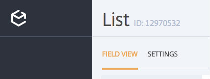

Also, we need a container for the app, so that the ```container``` property actually refers to a valid DOM-node:

```html
<body>

  <form id="authForm" onsubmit="return onAuthSubmit()">
    <input type="text" name="email">
    <input type="password" name="password">
    <input type="submit">
  </form>

  <div id="todo-app"></div>

</body>
```
That's it, our application now renders on the page, when the user is logged in.

##5. Setting up an organization & space

Podio Platform is designed for creating collaborative applications and therefore also ships with some concepts around clear separation of data between different groups of users.

At the top level our data needs to live within an **organization**. More specifically it needs to live within a **space** of an organization.

We therefore have to do a little bit of bootstrapping, before we can start sending and loading data, as we need at least one organization with at least on space in it.

Here's the code for handling that:

```javascript
ToDoApp.prototype.setUpWorkspace = function() {

  var self = this;

  // Retrieve a list of existing organizations in this project
  return self.podio.request('get', '/org/').then(function(organizations) {

    // If the project contains any organizations,
    // we simply use the first one we find
    if (organizations.length > 0) {
      return Promise.resolve(organizations[0]);
    } 
    
    // Otherwise, we create a new organization that we can use
    return self.podio.request('post', '/org/', { name: 'todo-app-organization' });

  })
  .then(function(organization) {

    var org_id = organization.org_id;
    
    // When we have the organization we do the same thing for spaces.
    // First, get a list of the spaces that exist in this organization.
    return self.podio.request('get', '/space/org/' + org_id + '').then(function(spaces) {

      // If we have existing spaces, we pick the second space in the array,
      // since the first space is the automatically generated 'Employee Network' space
      if(spaces.length > 1) {
        return Promise.resolve(spaces[1]);
      }

      // Otherwise, we create a new space that we can use
      var spaceData = {
        name: 'todo-app-space',
        org_id: org_id,
      };

      return self.podio.request('post', '/space/', spaceData);
    })
    .then(function(space) {
      // Now that we have the space, we can store the space_id for later use
      self.spaceId = space.space_id;
      return Promise.resolve();
    });
  });
};
```

##6. Loading data

The second thing our app will do, is load any existing list and task data from the backend and then store the data for those items in local references (```.lists``` and ```.tasks```).

We'll initialize these properties in the app's constructor:

```javascript
// ...
  this.listsTemplateId = config.listsTemplateId;
  this.tasksTemplateId = config.tasksTemplateId;
  this.podio = config.podio;

  this.lists = [];
  this.tasks = [];
// ...
```

So now let's look at loading the lists from the backend:

```javascript
ToDoApp.prototype.loadLists = function() {
    
  var self = this;

  return new Promise(function(resolve, reject) {
    self.podio.request('post', 'item/app/' + self.listsTemplateId + '/filter/?space_id=' + self.spaceId)
    .then(function(response) {
      self.lists = response.items;
      return resolve();
    })
    .catch(reject);
  });
};
```

Simple enough - we use the API to post a request for a filtering of all items under the app (template) with the id ```listTemplateId```. We then store these items on our class, so they can be used as reference in other methods.

The functionality for loading tasks looks quite similar:

```javascript
ToDoApp.prototype.loadTasks = function() {

  var self = this;

  return new Promise(function(resolve, reject) {
    self.podio.request('post','item/app/' + self.tasksTemplateId + '/filter/?space_id=' + self.spaceId)
    .then(function(response) {
      self.tasks = response.items;
      resolve();
    })
    .catch(reject);
  });
};
```


##7. Rendering data & Routing

####The HTML templates

The render methods will make use of predefined templates to render data. Therefore, we start out by extending our template store ```_templates``` with a few keys:

```javascript
var _templates = {

  body:
    '<div id="left-col">\
      <div id="lists"></div>\
      <input id="create-list-name-input" placeholder="Create list" />\
    </div>\
    <div id="right-col">\
      <div id="tasks"></div>\
      <div>\
        <input type="text" id="create-task-name-input" placeholder="Create task">\
      </div>\
    </div>',
  list: '<a href="<%= href %>"><%= name %></a> <span class="remove">X</span>',
  task: '<label><input type="checkbox" <%= checked %> /> <%= name %></label> <span class="remove">X</span>'
};
```

####Rendering lists

Let's start with the method for rendering lists. Each action has been commented to describe what is going on in detail:
```javascript
ToDoApp.prototype.drawLists = function() {

  var self = this;
  var listTemplate = _.template(_templates.list);

  return Promise.resolve().then(function() {

    // Get a reference to the lists section of the left column
    // since list items should be rendered in this
    var listsElement = self.containerElement.find("#lists");

    // Clear existing HTML
    listsElement.empty();

    self.lists.forEach(function(listItem) {

      // Get a reference to the list item's title field
      var titleField = _.find(listItem.fields, { external_id: 'title' });
      
      // Iterate through each list that have valid field data values
      if(listItem.fields.length && titleField.values.length) {

        // Retrieve title and item_id
        var itemName = titleField.values[0].value;
        var itemId = listItem.item_id;

        // Create a DOM element for this list, using the list template
        // and append it to the left column list container element
        var itemElement = $('<div></div>').html(listTemplate({
          href: '#' + itemId,
          name: itemName
        }))
        .addClass('list')
        .toggleClass('active', itemId == self.getCurrentList())
        .appendTo(listsElement);
        
        // Add a click handler to the remove button of the list,
        // so that the list can also be removed
        itemElement.find('.remove').on('click', function(listId) {

          this.deleteList(listId)
          .then(this.loadLists.bind(this))
          .then(this.drawLists.bind(this))
          .catch(console.error.bind(console));
        }.bind(self, itemId));
      }
    });
  });
};
```
In essence, what the function does is look through each of the list items that were retrieved in our ```.loadLists()``` method, extract the values of the field with an ```external_id``` of ```"title"``` and then create a DOM element using the value of ```_templates.list```.

As you can see, we make some use of LoDash for extracting the values and compiling the template.

Notice the anchor elements that we render for each list. They each have an ```href``` that points to ```#LIST_ITEM_ID```. Since ```.drawTasks()``` depends on this hash to be present in the address bar, let's quickly go over routing in the application before proceeding.

#### Routing
We use the hash to define the app's view state. Whenever the hash changes, we trigger the rendering cycle for tasks, so we can display the right tasks for the currently viewed list.

Listening for hash changes is simple, and we attach the listener in the constructor function:

```javascript
  // ...
  window.onhashchange = function() {

    this.drawLists()
    .then(this.drawTasks.bind(this, this.getCurrentList()))
    .catch(console.error.bind(console));
  }.bind(this);
```

For retrieving the id of the current list we simply read the hash in the url:

```javascript
var _getCurrentList = function() {
  return window.location.hash.substring(1);
};
```

#### Rendering tasks
Again, comments have been applied to shed light on what each section of code does:
```javascript
ToDoApp.prototype.drawTasks = function() {

  var self = this;
  var taskTemplate = _.template(_templates.task);
  var tasksElement = $('#tasks');
  
  // Clear all existing HTML in the task section
  tasksElement.empty();

  // If no current list is selected, we stop execution and display nothing
  if (_.isEmpty(_getCurrentList())) {
    return Promise.resolve();
  }

  // Get a reference to the selected list, by looking it up by its item_id
  var listItems = _.find(this.lists, { item_id: Number(_getCurrentList())});

  // Get a reference to the tasks of this list
  var listTasksReferences = _.find(listItems.fields, { external_id: 'tasks' });

  if (_.isEmpty(listTasksReferences)) {
    tasksElement.html('<p>(No tasks)</p>');
  } else {

    // If the list has task, iterate through them
    var tasks = listTasksReferences.values.forEach(function(taskReference) {

      var task = _.find(self.tasks, { item_id: taskReference.value.item_id });

      // Only proceed if the task exists in the app's internal reference
      if(_.isUndefined(task)) return;

      // Extract the various fields required for rendering
      var status = _.find(task.fields, { external_id: 'status' });
      var title = _.find(task.fields, { external_id: 'title' });
      var checked = status.values[0].value.text === 'Done';

      // Create a DOM node for the task and apply needed classes and content
      var taskElement = $('<div></div>');
      taskElement.addClass('task');
      taskElement.toggleClass('checked', checked);

      taskElement.html(taskTemplate({
        checked: checked ? 'checked' : '',
        name: title.values[0].value,
        class: status.values[0].value.text.toLowerCase()
      }));

      // Add click handler to the task so it can be checked/unchecked
      taskElement.find('input[type=checkbox]')
      .on('change', function(evt) {

        this.setTaskStatus(task.item_id, evt)
        .then(this.loadTasks.bind(this))
        .then(this.drawTasks.bind(this))
        .catch(console.error.bind(console));
      }.bind(self));

      // Add a click handler to the task's remove-button so the task can be deleted
      taskElement.find('.remove').on('click', function(taskId, evt) {

        this.deleteTask(taskId)
        .then(this.loadLists.bind(this))
        .then(this.loadTasks.bind(this))
        .then(this.drawTasks.bind(this))
        .catch(console.error.bind(console));
      }.bind(self, taskReference.value.item_id));

      // Add the task element to the task section DOM node of the page
      tasksElement.append(taskElement);
    });
  }
  return Promise.resolve();
};
```
This function basically uses the ```item_id``` of the current list to get a reference to it and there by its ```tasks``` field, which it will iterate over to render each task, much like the ```drawLists()``` method.

It also attaches event listeners to the rendered tasks' DOM nodes, so they can be toggled and deleted.

##8. Submitting data

####The input fields

Before the user can create lists and tasks, they need to have a place to input their data. The HTML of our app already contains input fields for specifying names for new lists and tasks, so we just need to add event listeners for handling the input.

To keep things simple, we will not use buttons for submitting the input. Instead, we'll rely on the user to press ENTER to submit the data.
For this, we write a small wrapper function that is to be used with the ```'keyup'``` event of the text field:
```javascript
function _bindPressEnter(callback) {
  return (function(evt) {
    if (evt.which === 13) {
      callback(evt);
    };
  });
};
```

This will run on every keystroke, but will only invoke ```callback``` when a keystroke for ENTER has happened.

Now, we can use this to bind the input fields to interactions within our app:

```javascript
var _bindButtons = function() {

  // Bind input for creating new lists
  this.containerElement.find('#create-list-name-input')
  .on('keyup', _bindPressEnter(function(evt) {

    this.createList({ title: $('#create-list-name-input').val() })
    .then(this.loadLists.bind(this))
    .then(this.drawLists.bind(this))
    .catch(console.error.bind(console));

    $('#create-list-name-input').val('');

  }.bind(this)));

  // Bind input for creating new tasks
  this.containerElement.find('#create-task-name-input')
  .on('keyup', _bindPressEnter(function(evt) {

    this.createTask({ title: $('#create-task-name-input').val() })
    .then(this.loadLists.bind(this))
    .then(this.loadTasks.bind(this))
    .then(this.drawTasks.bind(this))
    .catch(console.error.bind(console));
    
    $('#create-task-name-input').val('');

  }.bind(this)));
};
```

The handler for creating new lists first creates a new list using the value of the input field as the value for the ```title``` field.
It then reloads all lists from the server and lastly, it rerenders the lists on the page.

The handler for creating new tasks does the same thing respectively, but additionally it needs to reload the lists, since one of those lists will have a reference to the newly created task in its ```tasks``` field, and we depend on that reference for rendering the tasks in ```.drawTasks()```.

We just have to invoke this method in the constructor of our app now:
```javascript
// ...
  this.lists = [];
  this.tasks = [];

  _bindButtons.call(this);

  window.onhashchange = function() {
// ...
```

Now that our UI inputs are linked with our app's API, lets make sure that the functionality for creating items is actually there.

####Creating lists

The method for creating lists is quite simple:
```javascript
ToDoApp.prototype.createList = function(listData) {

  var data = {
    fields: {
      'title': listData.title
    },
    space_id: this.spaceId
  };
  return podio.request('post', 'item/app/' + this.listsTemplateId, data);
};
```

We simply format the input data and send the API request.

####Creating tasks

The code for creating tasks is a little more verbose, due to the fact that we have to both create a new task *and* update the list that it was created on with a reference to the newly created task:

```javascript
ToDoApp.prototype.createTask = function(taskData) {

  var self = this;

  // Prepare the data to be submitted for the new task
  var data = {
    fields: {
      'title': taskData.title,
      'status': [ 2 ]
    },
    space_id: this.spaceId
  };

  return new Promise(function(resolve, reject) {

    // Create the task on the backend
    podio.request('post', 'item/app/' + self.tasksTemplateId, data)
    .then(function(newlyCreatedTask) {

      // Get a reference to the current list and its list of tasks,
      // as we want to push the newlyCreatedTask to this list.
      var currentList = _.find(self.lists, { item_id: Number(_getCurrentList()) });
      var currentListTaskData = _.find(currentList.fields, { external_id: 'tasks' });
      var newTaskData = [];

      // Map over existing tasks to extract their item_id,
      // as this is the format that the backend expects
      if (currentListTaskData) {
        newTaskData = currentListTaskData.values.map(function(fieldValue) {
          return { value: fieldValue.value.item_id };
        });
      }

      // Add our new task
      newTaskData.push({ value: newlyCreatedTask.item_id });

      var listData = {
        fields: {
          tasks: newTaskData
        }
      };
      
      // Finally, update the list with the newly created task
      return podio.request('put', 'item/' + _getCurrentList(), listData);
    })
    .then(resolve)
    .catch(reject);
  });
};
```

Notice in both methods, that whenever we create items, we specify the ```space_id```, so that the data is saved within the space that was created by ```.setUpWorkspace()```.

##9. Updating data (toggling to-do tasks)

Marking tasks on a to-do list as 'done' is arguably the most important feature of any todo-app, so let's add the method for doing so:

```javascript
ToDoApp.prototype.setTaskStatus = function(taskId, evt) {

  var checkbox = evt.currentTarget;
  var task = _.find(this.tasks, { item_id: taskId });
  
  // Get a reference to the task status field,
  // so we can extract the correct sub_id for the field configuration values
  var taskStatusField = _.find(task.fields, { external_id: 'status' });
  
  // Convert the checkbox value into a string
  // that fits with our category field values
  var state = ['Pending', 'Done'][Number(checkbox.checked)];

  // Retrieve sub_id for the relavant state to use for the new status
  var newStatus = _.find(taskStatusField.config.settings.options, { text: state }).id;
  
  var taskData = {
    fields: {
      'status': [ newStatus ] // Notice the array. It is because category fields can have multiple values if configured for it
    }
  };

  // Save the task item
  return podio.request('put', 'item/' + taskId, taskData);
};
```

The method reads the value of the checkbox ```"change"``` event and converts it into the correct format to be used when sending the data to the backend. It then saves the item.

##10. Deleting data

As already documented, the listeners and handlers for the UI remove buttons are attached in the render functions for each type of item, respectively.

The delete methods are basically just proxies for the API. They simply delete an item by the specified ```item_id```.


####Deleting lists
```javascript
ToDoApp.prototype.deleteList = function(listId) {
  return podio.request('del', 'item/' + listId);
};
```

####Deleting tasks
```javascript
ToDoApp.prototype.deleteTask = function(taskId) {
  return podio.request('del', 'item/' + taskId);
};
```

##11. Styling
In order to make the app look and feel a little nicer to our users, we include a stylesheet ```style.css```:
```css
@import url(http://fonts.googleapis.com/css?family=Comfortaa:400,700);

body {
  margin: 40px;
  font-size: 18px;
  font-family: 'Comfortaa', cursive;
}

input {
  font-size: 18px;
  border: none;
  border-bottom: 1px dashed #ccc;
  outline: none;
}

#todo-app {
  width: 600px;
}

#left-col {
  float: left;
  min-width: 200px;
}

#right-col {
  margin-left: 200px;
}

a, a:visited {
  color: black;
  text-decoration: none;
}

.list {
  margin-bottom: 10px;
}

.list.active a {
  font-weight: bold;
  text-decoration: underline;
}

.remove {
  color: #ddd;
  cursor: pointer;
}

.remove:hover {
  color: #333;
}

.task {
  margin-bottom: 10px;
  cursor: pointer;
}

label {
  cursor: inherit;
}

.task.checked label {
  text-decoration: line-through;
}
```
And in ```index.html```:
```html
<head>
  <meta charset="UTF-8">
  <title>Podio Platform ToDo App</title>
  <link rel="stylesheet" href="style.css">
</head>
```
##11. The final result

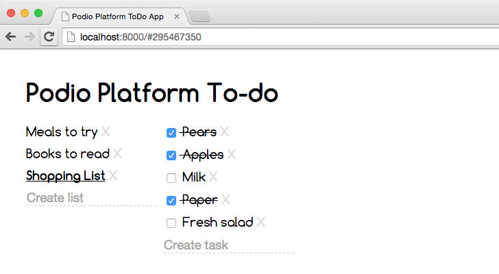

See the final source code of the application here in this repository.

If you'd like to see the working example running, then simply clone this repository and start a local webserver in the root of it:
```bash
$ python -m SimpleHTTPServer
```
And access the app at ```http://localhost:8000```